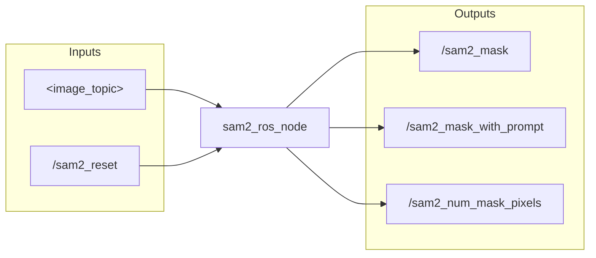

# segment-anything-2 real-time
Run Segment Anything Model 2 on a **live video stream**

# TYLER DOCUMENTATION (June 1, 2025)

NOTE: The purpose of this documentation is NOT to be super precise and detailed, but rather to be a quick reference for how to run the code and how it works.

## EXAMPLE VIDEO

This is an example that demonstrates the robustness of the Segment Anything Model 2 (SAM2) model (very robust).

This video shows SAM2 working at ~30Hz.

[GPT_Grounding_SAM2_Working_Screencast from 09-08-2024 01:33:52 AM.webm](https://github.com/user-attachments/assets/67d20173-a963-4659-a985-5d2843ba7e0a)

[SAM2_Robust_Screencast from 09-08-2024 07:07:12 PM.webm](https://github.com/user-attachments/assets/95849300-c1b2-47e9-8ca9-8344fb7e2e46)

## INPUTS AND OUTPUTS



* `image_topic` is the topic of the RGB image

* `sam2_reset` is a boolean trigger to reset the model. Concretely, if the object moves out of the frame entirely, SAM2 may start tracking the next most similar object. Even if the object returns, it will likely still track the wrong object. At this point, it should be reset with `rostopic pub /sam2_reset std_msgs/Int32 "data: 1"`. You can also modify the rosparam text prompt, then run this to restart tracking.

* `sam2_mask` is the mask of the object

* `sam2_mask_with_prompt` is the mask of the object with the bounding boxprompt overlaid

* `sam2_num_mask_pixels` is the number of pixels in the mask. If the number of pixels in the mask is too low, the model will reset to look for the object again.

You should set the following ROS parameters:
```
rosparam set /camera zed  # zed or realsense

# Either /text_prompt to prompt the model with what object should be segmented
# Or /mesh_file to prompt the model with a mesh of the object to be segmented
rosparam set /text_prompt "red snackbox"
rosparam set /mesh_file /path/to/mesh.obj  # This requires an OpenAI API key
```

This sets the image topic to use:

```
if camera == "zed":
    self.image_sub_topic = "/zed/zed_node/rgb/image_rect_color"
elif camera == "realsense":
    self.image_sub_topic = "/camera/color/image_raw"
```

## CHANGES
Difference between the default SAM2 (https://github.com/facebookresearch/segment-anything-2) and real-time SAM2 (https://github.com/Gy920/segment-anything-2-real-time):

* Creates `sam2_camera_predictor.py`, which is nearly identical to `sam2_video_predictor.py`, but doesn't read in all frames at once from a file, but predict sequentially on new images

Difference between real-time SAM2 (https://github.com/Gy920/segment-anything-2-real-time) and this fork of real-time SAM2 (https://github.com/tylerlum/segment-anything-2-real-time):

* Slight modifications to `sam2_camera_predictor.py` to properly handle bounding box prompts

* Addition of `sam2_ros_node.py`, which listens for RGB images and outputs a mask. It needs a prompt, which can come from a text prompt, a mesh => image => text prompt, or a hardcoded position

* Addition of `sam2_model.py`, which is a nice wrapper around the `sam2_camera_predictor.py`. It is very robust, doesn't seem to need to re-start tracking except for extreme cases.

* Addition of `mesh_to_image.py` to go from mesh to mesh image (pyvista), `image_to_description.py` to go from mesh image to text description (GPT-4o), `description_to_bbox.py` to go from text description to bounding box around that object in a new image (Grounding DINO), and `mesh_to_bbox.py` which puts these things together. All of these are runnable scripts you can try.

## HOW TO RUN

### Install

ROS Noetic installation with Robostack (https://robostack.github.io/GettingStarted.html)
```
conda install mamba -c conda-forge
mamba create -n sam2_ros_env python=3.11
mamba activate sam2_ros_env

# this adds the conda-forge channel to the new created environment configuration 
conda config --env --add channels conda-forge
# and the robostack channel
conda config --env --add channels robostack-staging
# remove the defaults channel just in case, this might return an error if it is not in the list which is ok
conda config --env --remove channels defaults

mamba install ros-noetic-desktop

mamba deactivate
mamba activate sam2_ros_env
```

Grounded SAM2 install (https://github.com/IDEA-Research/Grounded-SAM-2)
```
git clone https://github.com/IDEA-Research/Grounded-SAM-2
cd Grounded-SAM-2

cd checkpoints
bash download_ckpts.sh
cd ..

cd gdino_checkpoints
bash download_ckpts.sh
cd ..

pip3 install torch torchvision torchaudio
export CUDA_HOME=/path/to/cuda-12.1/  # e.g., export CUDA_HOME=/usr/local/cuda-12.2

pip install -e .
pip install --no-build-isolation -e grounding_dino --use-pep517  # The --use-pep517 flag is a weird fix I found

pip install supervision pycocotools yapf timm 
pip install dds-cloudapi-sdk==0.2.2
pip install flash_attn einops transformers pyvista trimesh termcolor

# May need to pip install a few other things, add to this list as needed
pip install tyro

# Can also get Grounding DINO 1.5 API token if desired, refer to https://github.com/IDEA-Research/Grounded-SAM-2 for details
# I put my api tokens in
vim ~/api_keys/grounded_sam_2_key.txt
vim ~/api_keys/tml_openai_key.txt
```

This repo:
```
cd checkpoints
./download_ckpts.sh
```

Useful ROS tools:
```
# ROS tools
mamba install ros-noetic-rqt-image-view
mamba install ros-noetic-rqt-plot
```

### Run

First run the camera with something like:

```
roslaunch realsense2_camera rs_camera.launch align_depth:=true
roslaunch zed_wrapper zed.launch
```

Check you can see the topics:
```
rostopic list  # See expected topics
```

If you are running across PCs, set the following:
```
# Set ROS variables if running across PCs
export ROS_MASTER_URI=http://bohg-ws-5.stanford.edu:11311  # Master machine
export ROS_HOSTNAME=$(hostname)  # This machine (e.g., bohg-ws-19.stanford.edu)
```

Run the ROS node:
```
python sam2_ros_node.py
```

Sanity check that the camera is working by viewing the RGB images and the SAM2 mask and mask with prompt:
```
rqt_image_view &
```

You can visualize debug signals /sam2_reset and /sam2_num_mask_pixels with:
```
rqt_plot
```

For some reason, I have had to do this sometimes:
```
mamba deactivate
mamba activate sam2_ros_env
```

If you get an error like this:
```
rqt_image_view &

[ERROR] [1748822629.917124127]: Failed to load nodelet [rqt_image_view/ImageView_0] of type [rqt_image_view/ImageView]: Failed to load library /home/tylerlum/miniconda3/envs/sam2_ros_env_v2/lib//librqt_image_view.so. Make sure that you are calling the PLUGINLIB_EXPORT_CLASS macro in the library code, and that names are consistent between this macro and your XML. Error string: Could not load library (Poco exception = libopencv_core.so.410: cannot open shared object file: No such file or directory)
```

This is a very strange and annoying error I have not fully figured out.

Check your opencv version and update the version to match:
```
python -c "import cv2; print(cv2.__version__)"
4.11.0
```

You can update it to match like so:
```
mamba install opencv=4.10 -c conda-forge
```

BUT, this may break other things like the sam2_ros_node.py.

```
  File "/home/tylerlum/miniconda3/envs/sam2_ros_env_v2/lib/python3.11/site-packages/cv_bridge/core.py", line 91, in encoding_to_cvtype2
    from cv_bridge.boost.cv_bridge_boost import getCvType
ImportError: /home/tylerlum/miniconda3/envs/sam2_ros_env_v2/lib/python3.11/site-packages/cv_bridge/boost/cv_bridge_boost.so: undefined symbol: _ZTIN5boost6python7objects21py_function_impl_baseE
```

## Running on a folder of images

```
python video_sam2.py \
--input_dir rgb/ \
--output_dir masks/
```

This takes in as input a directory `rgb` with images, and it outputs masks to the `masks` dir.

# SUCCESSES AND FAILURES

## Florence

Was better than Grounding DINO for things like "primary object", but not as reliable in general. When given a good prompt, Grounding DINO seemed to be better.

<div align="center">
  
  
</div>

<div align="center">
  
  
</div>

<div align="center">
  
  
</div>

<div align="center">
  
  
</div>

## Grounding DINO

Grounding DINO worked well with a good text prompt, but very poorly otherwise. This motivates the use of ChatGPT to caption the mesh image (automated pipeline without human).

<div align="center">
  
  
</div>

<div align="center">
  
  
</div>

<div align="center">
  
  
</div>

<div align="center">
  
  
</div>

## T-REX/DINO-V/OWL-VIT

T-REX and DINO-V and OWL-VIT can be conditioned on an image, but they were not reliable enough for me.

<div align="center">
  
</div>

https://huggingface.co/spaces/johko/image-guided-owlvit
<div align="center">
  
  
</div>


# ORIGINAL DOCUMENTATION

## News
- 20/08/2024 : Fix management of ```non_cond_frame_outputs``` for better performance and add bbox prompt

## Demos
<div align=center>
<p align="center">

</p>

</div>


## Getting Started

### Installation

```bash
pip install -e .
```
### Download Checkpoint

Then, we need to download a model checkpoint.

```bash
cd checkpoints
./download_ckpts.sh
```

Then SAM-2-online can be used in a few lines as follows for image and video and **camera** prediction.

### Camera prediction

```python
import torch
from sam2.build_sam import build_sam2_camera_predictor

checkpoint = "./checkpoints/sam2_hiera_large.pt"
model_cfg = "sam2_hiera_l.yaml"
predictor = build_sam2_camera_predictor(model_cfg, checkpoint)

cap = cv2.VideoCapture(<your video or camera >)

if_init = False

with torch.inference_mode(), torch.autocast("cuda", dtype=torch.bfloat16):
    while True:
        ret, frame = cap.read()
        if not ret:
            break
        width, height = frame.shape[:2][::-1]

        if not if_init:
            predictor.load_first_frame(frame)
            if_init = True
            _, out_obj_ids, out_mask_logits = predictor.add_new_prompt(<your promot >)

        else:
            out_obj_ids, out_mask_logits = predictor.track(frame)
            ...
```

## References:

- SAM2 Repository: https://github.com/facebookresearch/segment-anything-2
